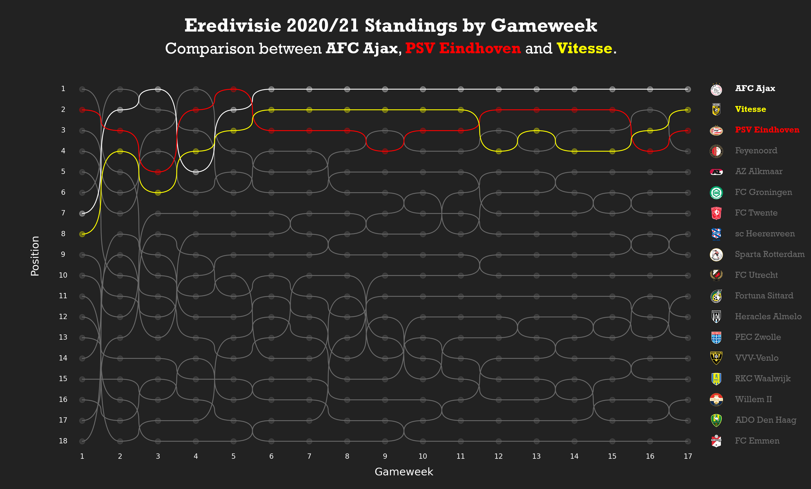

# Week by week League Standing with Bezier Curves

## Data
Data scraped from [worldfootbal.net](https://www.worldfootball.net/). 

Supported leagues:
* `premier league`
* `serie a`
* `league 1`
* `bundesliga`
* `eredivisie`

Store club crests in `./crests/`.

## Output
Example Eredivisie season 2020/21:

